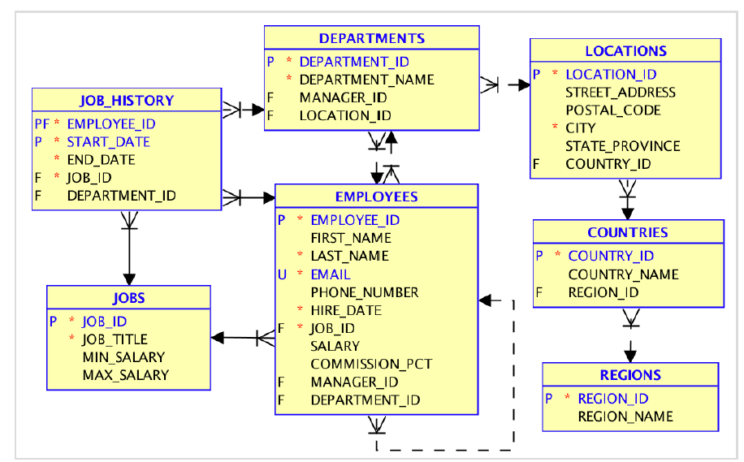

# Go2It.MySQL.HRSystem

1. Create a database to implement this image

Note:

 First of all, select dataTypes for corresponding columns. Pay attention:

o COUNTRIES table – Primary key is varchar, not number.

o Employees.Email must be unique

 Secondly, figure out the sequence of tables and data creation.

o For instance: a records in EMPLOYEES cannot be created before a records in DEPARTMENTS, record in JOB HISTORY cannot be created before the EMPLOYEE record

 In EMPLOYEES table employee has a manager – relation is maintained using the EMPLOYEE_ID

 In DEPARTMENTS table MANAGER_ID references an employee by EMPLOYEE_ID

2. Insert manually two records into EMPLOYEES table. Remember: in order to do it you need to prepare the rest of tables. After you do it, you can add seed extra data using this script

3. Write queries to return a corresponding data:

a. Get information about all Employees

b. Get all employees with a name ‘David’

c. Get all employees with job_id equals to ‘IT_PROG’

d. Get all employees from department 50 (department_id) and salary more than 4000

e. Get all employees from department 20 and 30 (department_id)

f. Get all employees whose last letter of the name equals to ‘a’

g. Get all employees from department 50 and 80 (department_id) who has a bonus (commission_pct is not empty)

h. Get all employees who has a salary in range of 8000-9000 including

i. Get all employees who has a name containing ‘%’ character

j. Get all managers (see the manager_id)

k. Get all the employees with their positions in format: Jessica(sh_clerk). Use concatenation to achieve it

l. Get all employees who has a name longer than 10 chars

m. Get all employees who was hired on the first day of any month

n. Get all employees who was hired in 2008

o. Get all employees who have a salary more than $20000 (including bonus % mentionedin commission_pct)

p. Get all employees and information regarding the their bonus (yes/no) using conditional operator

q. Create report by department_id with minimum and maximum salary, earliest and latest date of hire and number of employees. Sort the result by the number of employees in descending order (ie ‘1, 100000, 20000, 24-May-1990, 1-Jan-2020, 100’)

r. Show how many employees were hired in one year (find how to extract the year from date in MySQL)

s. Get department_id with more than 30 employees in it (using having)

t. Get manager_id with more than 5 subordinates whose total salary >500000. Use group by

u. Get max salary of all employees whose name ends with ‘CLERK’

v. For each country show its region (ie ‘Germany, Europe’)

w. Show all employees that work in department_name=’IT’

x. Get details information about each employee (First_name, Last_name, Departament, Job, Street, Country, Region)

y. Show manager names with >5 subordinates (use the same table twice)

z. Show all employees who don’t have manager

aa. Show all employees and their current status (`Currently working`/`Left the company` based on JOB_HISTORY.end_date)

bb. Get all employees who live in Region (ie in Europe)

cc. Show all departments with >30 employees (use having count(*))

dd. Show all departments that don’t have any employees

ee. Show all employees in format: First_name, Job_title, Department_name

ff. Get employees that have salary more than average in the company

gg. Get all employees whose manager gets salary > 15000

hh. Show all employees that are not managers

